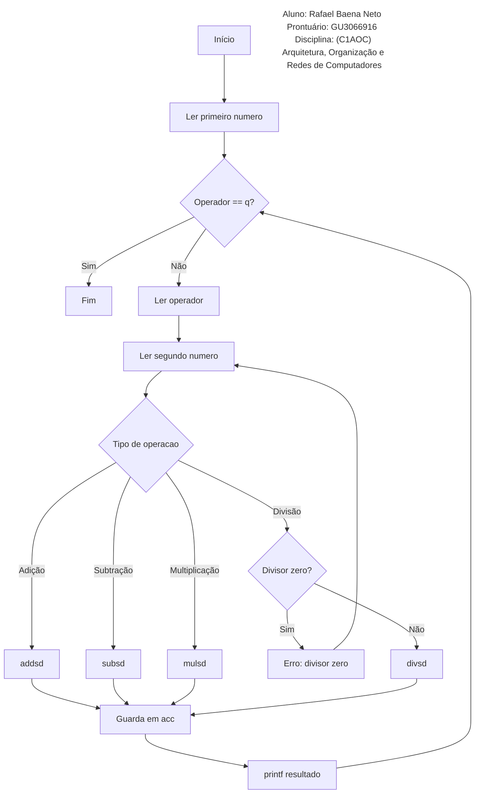

---

## `fluxo.md` (Mermaid)

```mermaid
flowchart TD
    A["Início"] --> B["Ler primeiro numero"]
    B --> C{"Operador == q?"}
    C -- Sim --> Z["Fim"]
    C -- Não --> D["Ler operador"]
    D --> E["Ler segundo numero"]
    E --> F{"Tipo de operacao"}
    F -- Adição --> G["addsd"]
    F -- Subtração --> H["subsd"]
    F -- Multiplicação --> I["mulsd"]
    F -- Divisão --> J{"Divisor zero?"}
    J -- Sim --> K["Erro: divisor zero"]
    K --> E
    J -- Não --> L["divsd"]
    G --> M["Guarda em acc"]
    H --> M
    I --> M
    L --> M
    M --> N["printf resultado"]
    N --> C
    n1["Aluno: Rafael Baena Neto  
Prontuário: GU3066916  
Disciplina: (C1AOC) Arquitetura, Organização e Redes de Computadores  "]

    n1@{ shape: text}


```
