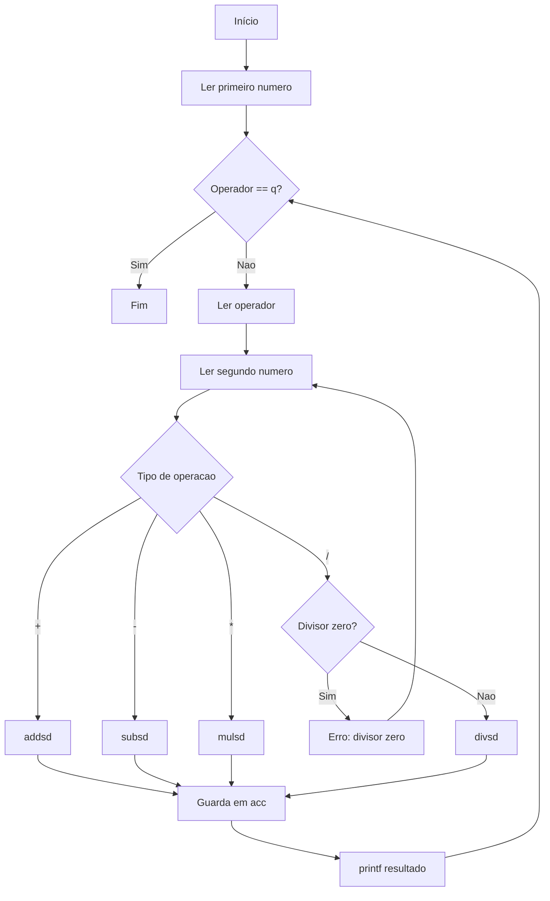

---

## `fluxo.md` (Mermaid)

Aluno: Rafael Baena Neto  
Prontuário: GU3066916  
Disciplina: (C1AOC) Arquitetura, Organização e Redes de Computadores  

```mermaid
flowchart TD
    A[Início] --> B[Ler primeiro numero]
    B --> C{Operador == q?}
    C -->|Sim| Z[Fim]
    C -->|Nao| D[Ler operador]
    D --> E[Ler segundo numero]
    E --> F{Tipo de operacao}
    F -->|+| G[addsd]
    F -->|-| H[subsd]
    F -->|*| I[mulsd]
    F -->|/| J{Divisor zero?}
    J -->|Sim| K[Erro: divisor zero]
    K --> E
    J -->|Nao| L[divsd]
    G --> M[Guarda em acc]
    H --> M
    I --> M
    L --> M
    M --> N[printf resultado]
    N --> C
```
